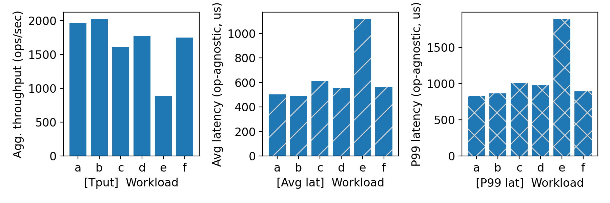
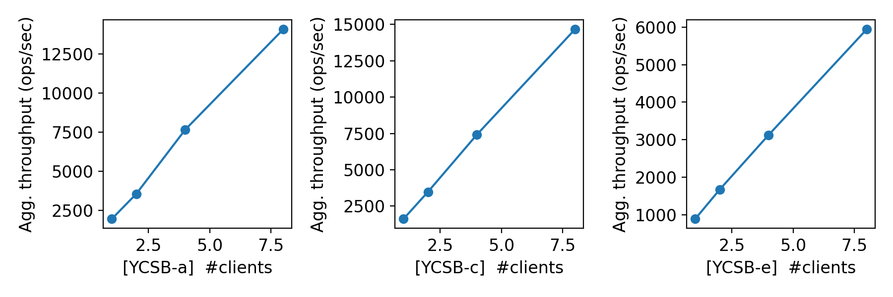
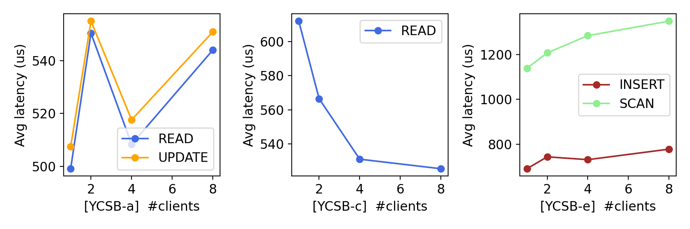

# CS 739 MadKV Project 1

## Design Walkthrough

### Code Structure

The implementation is written in C++17 and uses synchronous gRPC for communication between clients and the server. The Protocol Buffers file defines the five required operations: Put, Swap, Get, Scan, and Delete. The generated protobuf and gRPC code is shared by both executables.

The server implementation contains the in-memory key-value store and the gRPC service handlers. The client implementation reads commands from standard input, sends the corresponding unary RPC, and prints results using the exact format expected by the testing and benchmarking tools. CMake generates the protobuf sources and builds the client and server, while the project Justfile exposes recipes for building, launching, testing, fuzzing, and benchmarking.

### Server Design

The server stores all entries in a `std::map<std::string, std::string>`. A map was selected because it maintains keys in lexicographic order, allowing Get, Put, Swap, and Delete in logarithmic time and supporting ordered range scans through `lower_bound`.

The gRPC server may execute handlers concurrently, so every operation acquires one global `std::mutex`. The mutex protects both individual map operations and the complete Scan operation. Therefore, every RPC has one atomic critical section and all completed operations can be placed in a single global order. This provides the linearizable behavior required by the project, at the cost of serializing all clients. The project specifies an in-memory service without durability and requires a globally ordered view of completed requests.

### RPC Protocol

The service uses five synchronous unary RPCs:

- `Put(key, value)` writes the value and returns whether the key existed before the operation.
- `Swap(key, value)` atomically replaces the value. It returns the old value when the key existed and returns null otherwise. When the key is absent, the new key-value pair is still inserted.
- `Get(key)` returns the current value or null.
- `Scan(start_key, end_key)` returns an ordered repeated list of key-value pairs whose keys are in the inclusive range.
- `Delete(key)` removes the key and returns whether it existed.

Replies use a separate presence indicator where necessary so that a missing key can be distinguished from an existing key whose value is an empty string. Scan returns repeated key-value messages in dictionary order. These semantics match the required Project 1 API.

The client creates a gRPC stub connected to the address supplied through the Justfile recipe. Each input command causes one blocking RPC. After the reply arrives, the client prints one result before reading the next command. This preserves the input/output ordering required by the automated runner. The required stdin/stdout command format is described in the project specification.

## Self-provided Testcases

<u>Found the following testcase results:</u> 1, 2, 3, 4, 5

You will run some testcases during demo time.

### Explanations

**Testcase 1 — basic single-client operations.**  
This test exercises Put, Get, Swap, Scan, and Delete in one sequential client session. It verifies normal return values, ordered scan output, updates to existing keys, and deletion visibility.

**Testcase 2 — single-client edge cases.**  
This test covers missing keys, repeated deletion, replacement behavior, scan boundary cases, and Swap on an absent key. It specifically verifies that Swap returns null for an absent key while still inserting the new value.

**Testcase 3 — concurrent clients with disjoint keys.**  
Multiple client processes issue operations against separate key sets. The test checks that simultaneous requests do not corrupt shared state and that each client observes the correct results for its own keys.

**Testcase 4 — concurrent clients with overlapping keys.**  
Two clients access the same key. FIFO synchronization ensures that one client first receives acknowledgement for Put or Swap, after which the other client reads the key. This verifies cross-client visibility of acknowledged writes.

**Testcase 5 — concurrent deletion and recreation.**  
Multiple clients operate on the same key through Delete, Get, Put, and Swap. The test verifies that an acknowledged deletion becomes visible to another client and that a later recreation or Swap is also observed correctly.

Together, the tests cover the required two single-client cases, one non-conflicting concurrent case, and two interfering concurrent cases.

## Fuzz Testing

<u>Parsed the following fuzz testing results:</u>

num_clis | conflict | outcome
:-: | :-: | :-:
1 | no | PASSED
3 | no | PASSED
3 | yes | PASSED

You will run a multi-client conflicting-keys fuzz test during demo time.

### Comments

All three fuzz configurations passed: one client with disjoint keys, three clients with disjoint keys, and three clients with conflicting keys. The conflicting-key case is the most important because it tests whether responses from different clients can be explained by a consistent ordering of operations.

During development, fuzz testing exposed an incorrect initial interpretation of Swap. The first implementation returned null when the key was absent but did not insert the supplied new value. After changing Swap to always store the new value while returning null for a missing old value, all fuzz configurations passed.

The use of a single mutex makes each RPC atomic and prevents interleaving inside an operation. This simple design provides strong correctness, although it limits parallelism.

## YCSB Benchmarking

<u>Single-client throughput/latency across workloads:</u>

<u>Agg. throughput trend vs. number of clients:</u>

<u>Avg. latency trend vs. number of clients:</u>

### Comments

### Comments

The single-client results show that workloads A and B achieved the highest
throughput, at approximately 2,000 operations per second. Workloads C, D,
and F achieved lower but comparable throughput, while workload E was clearly
the slowest at approximately 900 operations per second.

Workload E also had the highest average and p99 latency. This is expected
because its Scan operations traverse multiple ordered entries, construct
repeated protobuf messages, and transfer larger responses. In comparison,
point reads and updates usually require one map lookup or modification and
a much smaller RPC response.

For workloads A, C, and E, aggregate throughput increased almost linearly
from one to eight clients. Workload A increased from approximately 2,000 to
14,000 operations per second, workload C increased from approximately 1,600
to 14,500 operations per second, and workload E increased from approximately
900 to 5,900 operations per second.

This indicates that a single client did not fully utilize the server and
network. Multiple client processes allowed RPC processing, network activity,
and work outside the map critical section to overlap. Although all map
operations use one global mutex, the serialized section was not yet the
dominant throughput bottleneck within the tested range of up to eight
clients.

The average latency of workload A remained relatively stable as the number
of clients increased. Workload C latency decreased slightly, which may be
caused by warm caches, scheduling effects, or measurement variation.
Workload E Scan latency increased moderately with more clients because scans
hold the mutex longer and serialize larger responses.

The results do not prove that the implementation scales indefinitely.
With client counts beyond eight, the global mutex is expected eventually to
limit throughput and increase queueing latency. Additional experiments with
more clients would be needed to identify that saturation point.

## Additional Discussion

The current design intentionally favors correctness and simplicity over scalability. Possible improvements include replacing the global mutex with a reader-writer lock, using finer-grained locking or sharding, shortening the Scan critical section, and adopting asynchronous gRPC handlers. Each optimization would require careful reasoning to preserve atomic operation semantics and linearizability.

The service is entirely in memory, so all state is lost when the server exits. Persistence, replication, and fault tolerance are outside the scope of Project 1 and can be introduced in later stages of MadKV.
