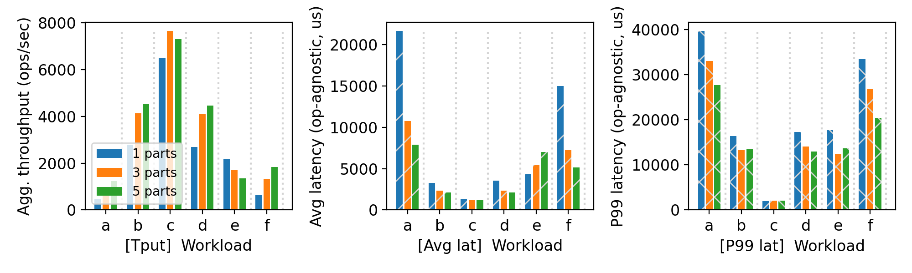
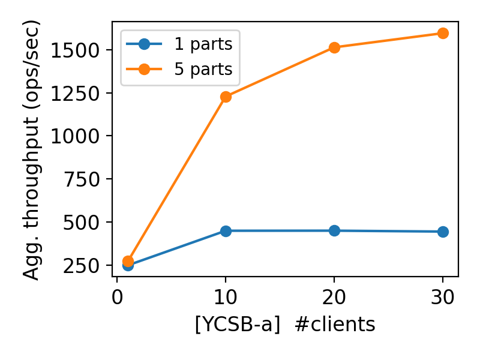

# CS 739 MadKV Project 2

## Design Walkthrough

Project 2 extends MadKV with durable mutation processing and static keyspace
partitioning. The implementation consists of a cluster manager, multiple
partition servers, and a partition-aware client.

### Durable mutation log

Each partition server stores its state in RocksDB. Mutating operations,
including `Put`, `Swap`, and `Delete`, are encoded as Protobuf command records
and appended to a durable command log before the server acknowledges the
request.

The RocksDB write uses synchronous WAL persistence so that an acknowledged
mutation survives a process crash. When a server starts, it opens the same
backing directory and replays the recorded commands to reconstruct the
partition state.

The durable directory is tied to the partition ID. For example, server `s1`
continues to use the same directory after being killed and restarted. A
restarted process therefore recovers its previous state instead of starting
with an empty key-value store.

### Duplicate-request handling

A client may not know whether a request completed when a server crashes after
persisting the mutation but before returning the response. Retrying the request
without duplicate detection could apply operations such as `Swap` more than
once.

To handle this case, every mutating request carries a request identifier. The
server persistently records completed request identifiers and their outcomes.
When the same request is retried, the server returns the previously recorded
result instead of executing the mutation again.

This provides an at-most-once effect for retried mutation requests, including
across server restarts.

### Static partitioning

The manager is initialized with a fixed ordered list of partition server
addresses. Each server registers with the manager using its partition ID, and
the manager reports the cluster configuration to clients.

Keys are assigned using a deterministic 64-bit FNV-1a hash:

```text
partition = fnv1a64(key) mod number_of_partitions
```

The same mapping is used by the client and servers. A server validates that an
incoming key belongs to its partition and rejects incorrectly routed
single-key requests.

The configuration is static for the lifetime of a test. Project 2 does not
perform dynamic rebalancing when a server joins or leaves.

### Client routing

For a single-key operation, the client obtains the cluster configuration from
the manager, hashes the key, and sends the request directly to the responsible
partition.

A `Scan` may cover keys from every partition. The client therefore sends the
scan to all partition servers, collects their results, merges them, sorts them
by key, and applies the requested result limit.

The client uses RPC deadlines and bounded exponential backoff when the manager
or a partition server is temporarily unavailable. During a crash test,
requests wait and retry until the original partition server is restarted.

### Recovery behavior

The intended recovery sequence is:

1. A server receives and durably records a mutation.
2. The process may crash before or after returning the response.
3. The replacement process starts with the same partition ID, address, and
   RocksDB directory.
4. The server replays its durable command log.
5. Retried requests are recognized through persistent duplicate-request
   metadata.
6. Client operations continue after the partition becomes available again.

The manager and the remaining partition servers stay online while a failed
partition is restarted.

## Self-provided Testcase

The self-provided testcase is a deterministic crash-and-retry scenario for a
three-partition cluster.

The testcase starts a manager and three partition servers with separate
persistent backing directories. It chooses keys that map to the three
different partitions and writes initial values to all of them.

It then sends a mutation to one selected partition using a fixed request ID.
The selected server is forced to crash after the mutation has been appended to
the durable log but before the client can rely on receiving a successful
response.

The server is restarted with the same:

- partition ID;
- network address;
- server list;
- RocksDB backing directory.

After recovery, the client retries the original mutation with the same request
ID. It then reads the affected key and scans the cluster.

The testcase verifies that:

1. the acknowledged initial values survive the process crash;
2. the interrupted mutation appears exactly once;
3. retrying the same request ID does not apply the mutation twice;
4. data stored on the unaffected partitions remains available;
5. a cluster-wide scan returns a correctly merged and ordered result.

### Explanations

This testcase targets the failure window that is most important for Project 2:
a server may persist a command and crash before the client receives its
response.

Durable logging alone is insufficient in this situation. Without persistent
duplicate detection, retrying a non-idempotent operation could change the
database twice. Conversely, duplicate detection without durable logging would
not recover the mutation after a restart.

The testcase therefore checks both mechanisms together:

- synchronous durable logging preserves the operation;
- replay reconstructs the partition state;
- persistent request metadata prevents duplicate execution;
- static routing sends the retry back to the recovered partition.

It also checks that partition failure is isolated. Crashing one partition must
not erase or corrupt data stored by the other partition servers.

## Fuzz Testing

<u>Parsed the following fuzz testing results:</u>

num_servers | crashing | outcome
:-: | :-: | :-:
3 | no | PASSED
3 | yes | PASSED
5 | yes | PASSED

You will run a crashing/recovering fuzz test during demo time.

### Comments

The first fuzz scenario used three partitions without injected crashes. It
exercised concurrent clients, conflicting operations, partition-aware routing,
and cluster-wide operations over 5,000 generated operations.

The second scenario used three partitions. During fuzzing, server `s1` was
killed with `SIGKILL` and later restarted with the same partition ID, address,
and durable backing directory. Client requests retried while the partition was
unavailable, and the test completed successfully after recovery.

The third scenario used five partitions. Servers `s1` and `s2` were killed
during the run and subsequently restarted using their original durable
directories. This scenario exercised simultaneous unavailability of multiple
partitions and recovery of multiple independent logs.

All three scenarios passed. The crash tests indicate that:

- committed data survived abrupt process termination;
- recovered servers reconstructed their state from persistent storage;
- retries did not cause duplicate mutation effects;
- the manager retained the static cluster configuration;
- clients resumed progress after the original partitions returned;
- partitioned execution remained consistent with the reference model.

The fuzz tests intentionally restarted the same logical partitions rather than
introducing replacement partitions with empty storage. This directly tests
crash recovery and durable replay.

## YCSB Benchmarking

<u>10 clients throughput/latency across workloads & number of partitions:</u>



<u>Agg. throughput trend vs. number of clients w/ and w/o partitioning:</u>



### Comments

The first figure compares workloads A through F using 10 clients and 1, 3, or
5 partitions. The measurements report aggregate throughput, average latency,
and P99 latency.

Workload C achieved the highest throughput and some of the lowest latency
because it is read-only. Reads require no durable mutation logging and can be
routed directly to one partition.

Workloads A and F showed higher latency because they include updates or
read-modify-write operations. Mutations require synchronous durable writes,
and workload F performs multiple logical steps for each operation.

For most point-operation workloads, increasing the number of partitions
improved throughput and reduced average latency. Requests were distributed
among multiple server processes, allowing more operations to execute in
parallel.

Workload E behaved differently because it contains scan operations. A scan is
sent to every partition, and the client must wait for all responses, merge the
results, sort them, and enforce the result limit. Increasing the number of
partitions therefore increases fan-out and coordination overhead. Scan
performance is not expected to scale in the same way as point reads or writes.

The P99 latency values do not always change monotonically. Tail latency is
sensitive to process scheduling, synchronous RocksDB writes, RPC timing, cache
state, and temporary contention between partition processes.

The second figure compares workload A with 1 and 5 partitions as the number of
clients increases from 1 to 30.

The single-partition configuration improved between 1 and 10 clients but then
remained near its saturation point. Additional clients increased concurrency
but could not create additional server-side capacity for the single partition.

The five-partition configuration continued to improve through 20 and 30
clients. Its throughput was substantially higher at larger client counts
because requests could be processed concurrently by five partition server
processes.

The improvement is sublinear. All partition servers ran on the same physical
VM and therefore shared CPU, memory, storage, and network resources. The
benchmark demonstrates process-level parallelism and the benefit of
partition-aware routing, rather than scaling across five independent physical
machines.

The physical benchmark topology was:

- `madkv-server` (`10.128.0.2`): manager and all partition server processes;
- `madkv-client` (`10.128.0.3`): YCSB/bencher client processes and report
  generation;
- both VMs were located in the same Google Cloud zone.

## Additional Discussion

The implementation uses a static partition map. It does not migrate existing
keys or rebalance data while the cluster is running. Changing the number or
order of partitions would change the modulo-based key mapping, so each
benchmark scenario starts with a fresh cluster configuration and empty backing
directories.

The manager is not a replicated service and remains a single point of failure.
The crash tests focus on partition server failures, as required for this
project.

A cluster-wide scan contacts every partition, so its latency is bounded by the
slowest participating server. This is a deliberate tradeoff in the current
design. More advanced systems could use range partitioning, distributed
indexes, pagination tokens, or parallel result streaming to improve scan
performance.

Finally, the benchmark results should be interpreted as relative comparisons
between configurations. Absolute throughput depends on the VM type, shared
hardware resources, storage behavior, compiler settings, and RPC overhead.
